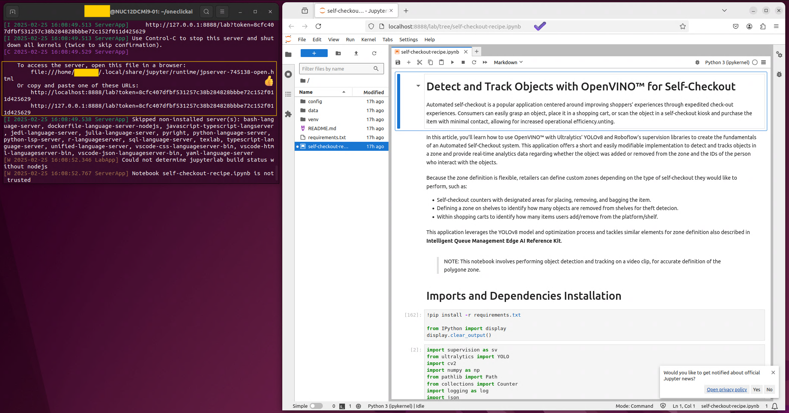
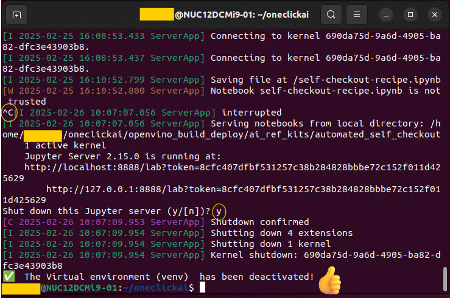
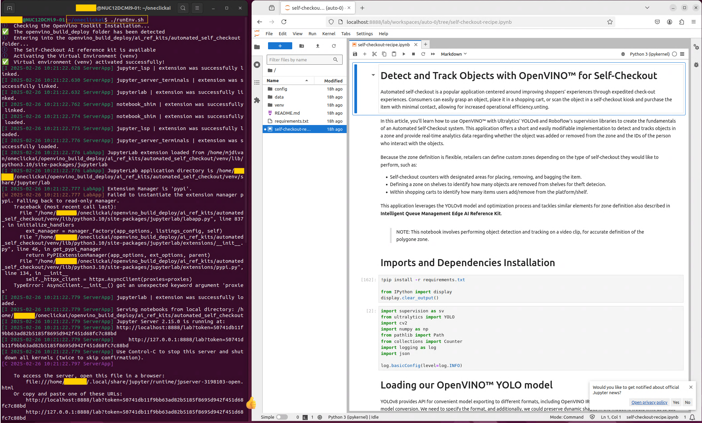
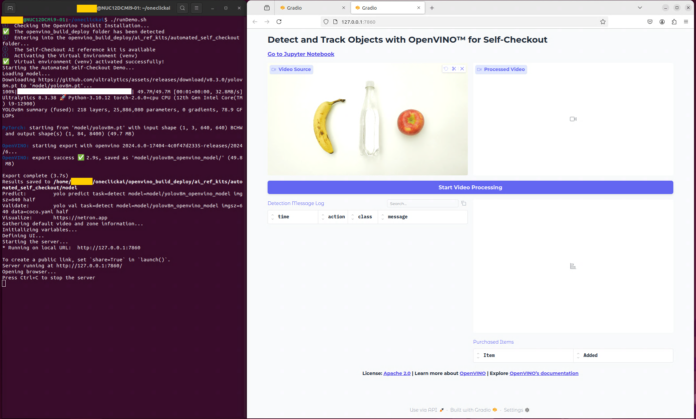
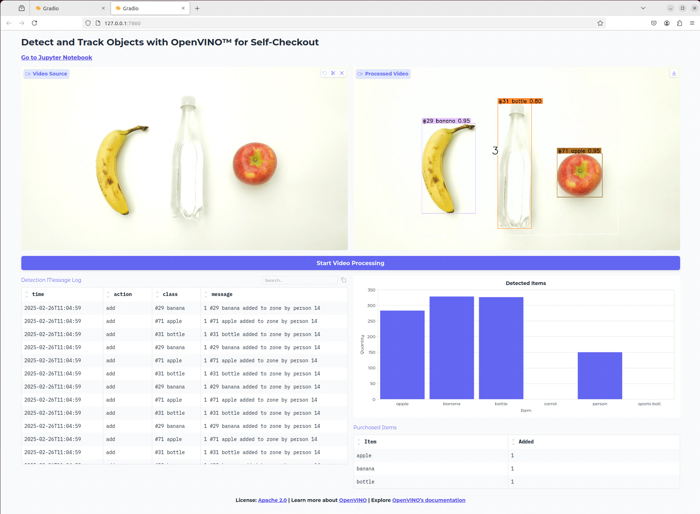
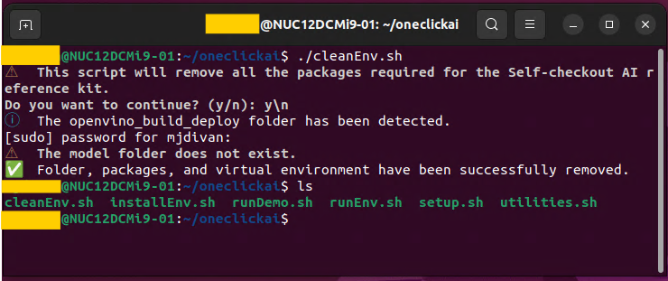

<div id="top" align="center">
  <h1>Scripts | Automated Self-Checkout with OpenVINO™ Toolkit</h1>
  <h4>
    <a href="https://www.intel.com/content/www/us/en/developer/topic-technology/edge-5g/open-potential.html">🏠&nbsp;About&nbsp;the&nbsp;Kits&nbsp;·</a>
    <a href="self-checkout-recipe.ipynb">📔&nbsp;Jupyter&nbsp;Notebook&nbsp;·</a>
    <a href="https://www.youtube.com/watch?v=VrJRr_thxcs">📺&nbsp;Overview&nbsp;Video&nbsp;·</a>
    <a href="https://www.youtube.com/watch?v=rw8cTr-hD-g">👨‍💻&nbsp;Code&nbsp;Demo&nbsp;Video&nbsp;·</a>
    <a href="https://www.intel.com/content/www/us/en/developer/articles/training/detect-objects-openvino-automated-self-checkout.html">📚&nbsp;Step&#8209;by&#8209;step&nbsp;Tutorial</a>
    <a href="README.md">📄&nbsp;README.md&nbsp;</a>
  </h4>
</div>

[](https://github.com/openvinotoolkit/openvino_build_deploy/blob/master/LICENSE.txt)

A set of scripts provides a quick run to install, run, and clean the environment and run the demo visually in a direct way. It targets Ubuntu Linux 22.04+, and an explanation of how to use it is available here. On the other hand, you could follow the steps indicated in the [README.md](./README.md) file for a manual and step-by-step installation in case of a different platform.

The scripts are tested on Ubuntu Linux and running with sudo (or
administrative user).

**Table of Contents:**

- [Environment Installation](#environment-installation)
- [Direct Running of the Demo](#direct-running-of-the-demo)
- [Cleaning the Environment](#cleaning-the-environment)

## Environment Installation

It creates a folder in the home directory to download the repository and  initialize the virtual environment containing all required libraries to run the demo or use the jupyter lab notebook.

1. Download [setup.sh](./scripts/setup.sh) in your home directory
2. Grant execution permissions
  
    ```bash
    sudo chmod +x setup.sh
    ```

3. Run the setup file.

    ```bash
    ./setup.sh
    ```

Once finished the environment setup and installation, jupyter lab is automatically opened in your browser (See Figure 1).


**Figure 1. The Script Output and Jupyter Lab Welcome Screen**

> When Jupyter Lab is not automatically open on the browser, you can click on the link in the yellow rectangle.

The JupyterLab notebook is ready to be executed, and all required libraries are installed. You can run the instructions step by step to follow the Tutorial. However, if you want to follow the Tutorial at a later time, you can shut down the Jupyter Lab server in the console using the interruption keystroke ("Ctrl + C"). As shown in Figure 2, the server will ask for confirmation (See yellow circles), after which, once received, the server finishes, and the virtual environment gets deactivated.


**Figure 2. Finishing the JupyterLab Server**

You can start the tutorial anytime by going to the oneclickai directory and running the runEnv.sh script, as shown in Figure 3.


**Figure 3. Restarting the JupyterLab Server**

As you may know, the notebook allows you to experiment with the different steps and run each per time until reaching the final output. Again, "Ctrl + C" in the console lets you shut down the server.

## Direct Running of the Demo

This section demonstrates how to run the demo, visually showing an interactive User Interface using the object detection and tracking algorithm. It is helpful for demonstrations and does not require Step-by-step instructions because they are automatically running in the background for you.

The demo incorporates a new Gradio-based UI (More about [Gradio](https://www.gradio.app/)) providing interactivity and additional options to process the video ([See the Jupyter Notebook](https://github.com/openvinotoolkit/openvino_build_deploy/blob/master/ai_ref_kits/automated_self_checkout/self-checkout-recipe.ipynb)). Some of the main features are:

- It can choose a different video for previewing (full or small screen) and processing it.
- The processed video is shown when the batch of frames is released (progressive).
- It can save the final processed video for future reference.
- A Log table allows the user to filter outputs dynamically while the video is under processing or once processed.
- A bar plot shows the detected object classes and their frequency.
- The purchased items are shown as an independent table to contrast them with log messages and detected objects.

The following simple steps is all you need to start the demo:

1. Go to the  ~/oneclickai folder
2. Run the runDemo.sh script. The YOLO model will be automatically downloaded in case of required. You will see a similar to Figure 4.


**Figure 4. Starting the Demo UI**

The demo UI has 4 main regions as follows:

- **Video Source (Top Left component)**: It initializes with a default video for your reference. You can pre-visualize the video in the current window or using full-screen mode. If you want to use it and see the demo running, just press the "Start video processing" button. However, you could change the video by pressing the "x" in the top right section of it and choosing a new one. The mp4 format is supported.
- **Processed Video (Top right component)**: This component shows the processed video once it has been released by the detection and tracking algorithm. It updates the frames as soon as they are available, and it does not require waiting for the whole video processing. Thus, it can see partial results according to the video processing advances. You can download the final processed video by clicking the &#10515; icon at the top right section of the video.
- **Detection Message Log (Bottom left component)**: It is a table that incorporates the actions informed (i.e., add or remove) for the different classes (for example, banana) and instances (#29 banana) with the corresponding timestamp. Recent logs are included at the beginning of the table, leaving the older ones below. The search text field allows you to filter the table according to the specified text. It is updated as soon as the algorithm releases the messages.
- **Detected Components and Purchased Items (Bottom right components)**: Detected components is a barplot describing the detected classID and the associated detection frequency. It is updated with video processing, and the figure can be saved as an image file (PNG). On the other hand, the "Purchased Items" table contains the output understood by the algorithm as purchased effectively after the adding and removing operations. It is updated with the video processing.


**Figure 4. Final State for the Demo UI using the Default Video**

You can filter the log table, save the processed video, and save the bar plot as an image even once finished the video processing of your video. It helps track objects through the video and review those strange situations, for example, detections of a "carrot" or "sports ball."

The source code of this demo is included in the [self-checkout-recipe.ipynb](self-checkout-recipe.ipynb) file to review the step-by-step approach or in the [directrun.py](directrun.py) file for a direct execution. You can finish the server using the "Ctrl + C" keystroke.

# Cleaning the environment

It removes the OpenVino framework, virtual environment, and associated libraries, leaving the oneclickai folder with the scripts. It does not remove the Linux packages (for example, git). You can remove the folder with a simple deletion or use scripts to reinstall and run the demo when required.


**Figure 4. Cleaning the Environment**

As the previous figure shows, the script requests confirmation to proceed with the directory removal. Once done, the scripts are the only remaining files. You can delete the folder if it is no longer required because all the required codes are installed exclusively in the "oneclickai "folder without external ramifications in the filesystem. The idea is to have as simple an installation and removal approach as possible.
