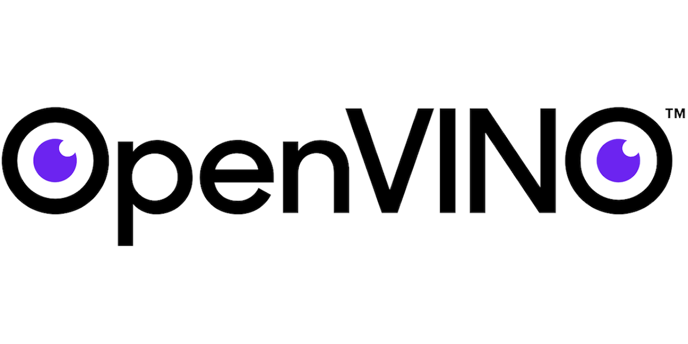
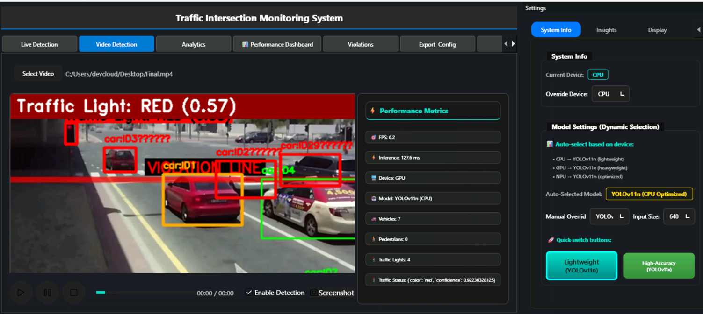

# Smart Intersection Traffic Monitoring System

<p align="center">

</p>
<p align="center">
  
  
</p>

## Quick Access

- [Project Overview](#project-overview)
- [Tech Stack](#tech-stack)
- [Installation & Setup](#installation--setup)
- [Configuration](#configuration)
- [Usage Guide](#usage-guide)
- [Building & Deployment](#building--deployment)
- [Key Features](#key-features)
- [Troubleshooting](#troubleshooting)
- [License](#license)
- [Contributors](#contributors)
- [Acknowledgments](#acknowledgments)

## Project Overview

<p align="center">
  
</p>

<p align="center">
  
  
</p>

<p align="center">
  
</p>

---

The **Smart Intersection Traffic Monitoring System** is an advanced AI-powered desktop application built with PySide6 and OpenVINO for real-time traffic monitoring, violation detection, and smart intersection analytics. The system combines computer vision, machine learning, and IoT technologies to provide comprehensive traffic management capabilities with enterprise-grade features.

### Features

- **Real-time Object Detection**: YOLO11 (n/x) models with OpenVINO optimization for vehicles, pedestrians, and traffic lights
- **Intelligent Violation Detection**: Red light violations, crosswalk violations, speed violations, and wrong-way detection
- **Multi-Device Support**: CPU, GPU, and AUTO device selection with Intel Arc GPU optimization
- **Vision-Language Model (VLM)**: OpenVINO GenAI integration for scene understanding and natural language analysis
- **Real-time Analytics**: Live dashboards with vehicle tracking, traffic patterns, and performance metrics
- **IoT Integration**: MQTT + InfluxDB + Grafana for data streaming and visualization
- **Multi-Source Input**: Webcam, RTSP streams, video files, and drag-and-drop support
- **Performance Monitoring**: FPS, latency, CPU/GPU utilization tracking with benchmark export
- **Modern UI**: Dark/light themes, responsive design, and intuitive tabbed interface

---

## Tech Stack

### Core Technologies

- **Frontend**: PySide6 (Qt6) - Modern desktop GUI framework
- **AI/ML Engine**: OpenVINO 2025.2+ - Intel's AI inference optimization toolkit
- **Computer Vision**: OpenCV 4.11+ - Image and video processing
- **Object Detection**: YOLO11 (Ultralytics) - State-of-the-art detection models
- **Object Tracking**: ByteTrack, DeepSORT - Multi-object tracking algorithms
- **VLM Integration**: OpenVINO GenAI - Vision-Language Model pipeline

### Data & Analytics

- **Time-Series DB**: InfluxDB - Real-time metrics storage
- **Message Broker**: MQTT (Mosquitto) - IoT data streaming
- **Visualization**: Grafana - Real-time dashboards and alerts
- **Data Export**: Pandas, CSV/JSON - Analytics and reporting

### Performance & Deployment

- **Packaging**: PyInstaller - Cross-platform executable generation
- **Containerization**: Docker + Docker Compose - Service orchestration
- **Monitoring**: Performance overlay, benchmark logging
- **Configuration**: JSON-based config management with live updates

---

## Installation & Setup

### Prerequisites

#### System Requirements

- **OS**: Windows 10+, macOS 10.14+, or Ubuntu 18.04+
- **Python**: 3.8 - 3.11 (recommended: 3.11)
- **Memory**: Minimum 8GB RAM (16GB recommended for VLM)
- **GPU**: Intel Arc,or AMD GPU (optional but recommended)
- **Storage**: 5GB free space for models and dependencies

#### Hardware Acceleration (Optional)

- **Intel**: Intel Arc GPU, or Intel integrated graphics
- **AMD**: ROCm-compatible GPU

### Quick Installation

#### 1. Clone and Setup Environment

```bash
# Clone the repository
cd qt_app_pyside1

# Create virtual environment
python -m venv .venv
source .venv/bin/activate  # Linux/macOS
# or
.venv\Scripts\activate     # Windows

# Install dependencies
pip install -r requirements.txt
```

#### 2. Download AI Models

```bash
# YOLOv11 models will be downloaded automatically on first run
# Or manually download:
# - Place yolo11n.xml/bin in openvino_models/
# - Place yolo11x.xml/bin in parent directory

# VLM models (optional, for advanced features)
python vlm_backend/model_downloader.py
```

#### 3. Configure Services (Optional)

```bash
# Start backend services
docker-compose up -d

# Or manually configure:
# - MQTT: localhost:1883
# - InfluxDB: localhost:8086
# - Grafana: localhost:3000
```

#### 4. Run Application

```bash
# Standard mode
python main.py

# Enhanced mode with advanced features
python run_app.py

# Debug mode
python main.py --debug
```

---

## Configuration

### Core Configuration (`config.json`)

```json
{
  "detection": {
    "confidence_threshold": 0.5,
    "iou_threshold": 0.45,
    "model": "yolo11n",
    "device": "GPU",
    "enable_tracking": true
  },
  "violations": {
    "red_light_grace_period": 2.0,
    "enable_red_light": true,
    "enable_crosswalk": true,
    "enable_speed": true
  },
  "display": {
    "show_confidence": true,
    "show_labels": true,
    "max_display_width": 1280
  },
  "performance": {
    "max_history_frames": 1000,
    "cleanup_interval": 3600
  }
}
```

### Environment Variables

```bash
# Optional: Override default paths
export OPENVINO_MODEL_PATH="/path/to/models"
export VLM_MODEL_PATH="/path/to/vlm/models"
export INFLUXDB_URL="http://localhost:8086"
export MQTT_BROKER="localhost:1883"

# Optional: Device preferences
export OPENVINO_DEVICE="GPU"
export OPENVINO_PRECISION="FP16"
```

### Device Configuration

The application automatically detects available devices:

- **CPU**: Always available, good for compatibility
- **GPU**: Intel Arc, NVIDIA, AMD (recommended for performance)
- **AUTO**: OpenVINO automatically selects optimal device

---

## Usage Guide

### 1. Live Video Monitoring

1. **Launch Application**: Run `python main.py`
2. **Select Input Source**:
   - **Webcam**: Select camera index (0, 1, 2...)
   - **RTSP Stream**: Enter stream URL (e.g., `rtsp://camera.ip/stream`)
   - **Video File**: Drag & drop or browse for video files
3. **Configure Detection**:
   - Choose device (CPU/GPU/AUTO)
   - Select model (YOLOv11n for speed, YOLOv11x for accuracy)
   - Adjust confidence and IoU thresholds
4. **Enable Features**:
   - Red light violation detection
   - Crosswalk monitoring
   - Vehicle tracking
   - Performance overlay

### 2. Analytics & Reporting

- **Analytics Tab**: View real-time statistics, charts, and trends
- **Violations Tab**: Review detected violations with evidence
- **Performance Tab**: Monitor system performance and benchmarks
- **Smart Intersection**: Multi-camera intersection analytics
- **VLM Insights**: Natural language scene analysis

### 3. Data Export & Integration

- **CSV/JSON Export**: Export detection data and analytics
- **MQTT Streaming**: Real-time data to external systems
- **InfluxDB Storage**: Time-series data for long-term analysis
- **Grafana Dashboards**: Professional visualization and alerts

### 4. Performance Benchmarking

```bash
# Run benchmark across devices/models
python benchmark_logger.py

# Generate performance reports
python plot_benchmarks.py

# View results in benchmark_graphs/
```

---

## Building & Deployment

### Cross-Platform Executable

```bash
# Build for current platform
python build_crossplatform.py

# Outputs:
# - dist/TrafficMonitor/         (Release version)
# - dist/TrafficMonitorDebug/    (Debug version)
# - install_trafficmonitor_*.sh  (Installer scripts)
```

### Docker Deployment

```bash
# Build and run containerized version
docker-compose up --build

# Service endpoints:
# - App: http://localhost:8501
# - Grafana: http://localhost:3000
# - InfluxDB: http://localhost:8086
```

### Service Installation

```bash
# Windows
install_trafficmonitor_windows.bat
```

---

## Key Features

### 1. AI-Powered Detection

- **YOLO11 Models**: Latest Ultralytics models optimized for traffic scenarios
- **OpenVINO Acceleration**: Intel hardware optimization for maximum performance
- **Multi-Class Detection**: Vehicles, pedestrians, cyclists, traffic lights
- **Real-time Tracking**: ByteTrack algorithm for persistent object tracking

### 2. Smart Violation Detection

- **Red Light Violations**: Advanced traffic light state detection with grace periods
- **Crosswalk Monitoring**: Pedestrian safety with violation line detection
- **Speed Analysis**: Vehicle speed estimation and violation alerts
- **Wrong-Way Detection**: Advanced traffic flow analysis

### 3. Vision-Language Integration

- **Scene Understanding**: Natural language descriptions of traffic scenes
- **Incident Analysis**: AI-generated reports for violations and anomalies
- **Interactive Queries**: Ask questions about traffic situations
- **Automated Reporting**: Generate detailed incident reports

### 4. Enterprise Integration

- **MQTT Streaming**: Real-time data for traffic management systems
- **InfluxDB Storage**: Scalable time-series data storage
- **Grafana Dashboards**: Professional monitoring and alerting
- **REST API**: Programmatic access to detection and analytics

### 5. Performance Optimization

- **Multi-Device Support**: Automatic selection of optimal processing device
- **Model Quantization**: FP32, FP16, INT8 support for efficiency
- **Asynchronous Processing**: Non-blocking UI with threaded processing
- **Memory Management**: Efficient handling of video streams and models

---

### Adding Features

1. **New Detection Logic**: Add to `controllers/video_controller_new.py`
2. **UI Components**: Create in `ui/` directory
3. **Utilities**: Add to `utils/` package
4. **Services**: Extend `services/` configuration

### Extending VLM Capabilities

```python
# Add new VLM analysis in vlm_controller.py
def analyze_custom_scene(self, frame, prompt):
    return self.vlm_pipeline.generate(frame, prompt)
```

---

## Troubleshooting

### Common Issues

#### 1. Model Loading Errors

```bash
# Download models manually
wget https://github.com/ultralytics/assets/releases/download/v0.0.0/yolo11n.pt
python convert_model.py yolo11n.pt
```

#### 2. OpenVINO Device Issues

```bash
# Check available devices
python -c "import openvino as ov; print(ov.Core().available_devices)"

# Reset device selection
rm -rf ~/.cache/openvino
```

#### 3. Service Connection Issues

```bash
# Check service status
docker-compose ps

# Restart services
docker-compose restart
```

#### 4. Performance Issues

- **Low FPS**: Switch to faster model (YOLOv11n) or reduce resolution
- **High Memory**: Reduce `max_history_frames` in config
- **GPU Issues**: Update drivers and check OpenVINO device support

### Debug Mode

```bash
# Enable detailed logging
python main.py --debug --log-level DEBUG

# Performance profiling
python main.py --profile --benchmark
```

---

## License

This project is licensed under the Apache License 2.0 - see the [LICENSE](LICENSE) file for details.

---

## Contributors

- **Lead:** Jatin Sachdeva
- **Mentors:** Hassnaa Moustafa, Zhuo Wu, Vibhu Bithar

## Acknowledgments

- **Intel OpenVINO**: AI acceleration and optimization framework
- **Ultralytics**: YOLO11 object detection models
- **Qt/PySide6**: Cross-platform GUI framework
- **OpenCV**: Computer vision library
- **InfluxDB & Grafana**: Time-series data platform

---

_Built with ❤️ for intelligent traffic management and smart city applications._
