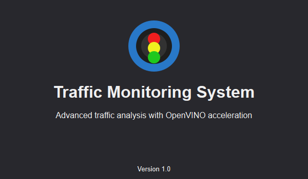
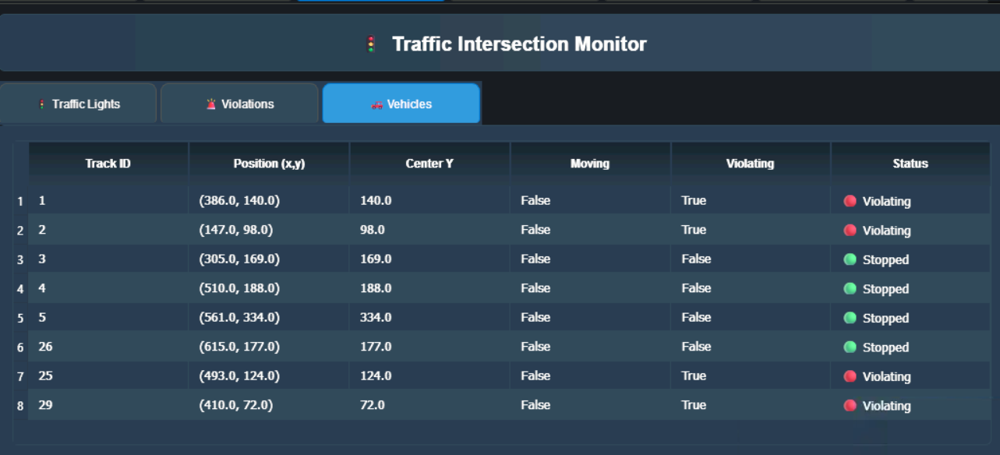
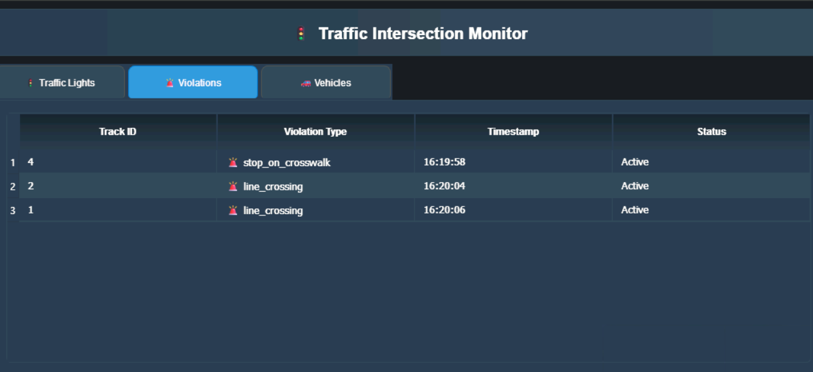
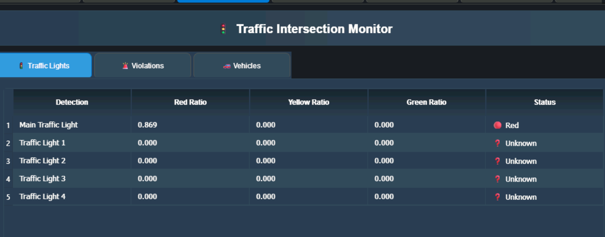

# Smart Intersection Traffic Monitoring System

<p align="center">

</p>
<p align="center">
  
  
</p>

## Quick Access

- [Project Overview](#project-overview)
- [Architecture](#architecture)
- [Installation & Setup](#installation--setup)
- [Configuration](#configuration)
- [Usage Guide](#usage-guide)
- [Building & Deployment](#building--deployment)
- [Key Features](#key-features)
- [API Reference](#api-reference)
- [Services Integration](#services-integration)
- [Troubleshooting](#troubleshooting)
- [License](#license)
- [Contributors](#contributors)
- [Acknowledgments](#acknowledgments)

## Project Overview

<p align="center">
  
</p>

<p align="center">
  
  
</p>

<p align="center">
  
</p>

---

The **Smart Intersection Traffic Monitoring System** is an advanced AI-powered desktop application built with PySide6 and OpenVINO for comprehensive traffic monitoring, violation detection, and smart intersection analytics. The system features a modern tabbed interface with real-time analytics, VLM (Vision-Language Model) insights, and enterprise-grade IoT integration capabilities.

### Features

- **Real-time Object Detection**: YOLO11 (n/x) models with OpenVINO optimization for vehicles, pedestrians, and traffic lights
- **Advanced Violation Detection**: Red light violations, crosswalk violations, wrong way violation
- **Multi-Device Support**: CPU, GPU, and AUTO device selection with Intel Arc GPU optimization
- **Vision-Language Model (VLM)**: OpenVINO GenAI integration for scene understanding and natural language analysis
- **Modern UI Interface**: Tabbed interface with Analytics, Violations, Export, and VLM Insights tabs
- **IoT Integration**: MQTT + InfluxDB + Grafana for data streaming and visualization
- **Multi-Source Input**: Webcam, RTSP streams, video files, and drag-and-drop support
- **Performance Monitoring**: Real-time FPS, latency, CPU/GPU utilization tracking with overlay display
- **Enhanced Tracking**: ByteTrack, DeepSORT algorithms with enhanced object tracking capabilities
- **Data Export**: CSV/JSON export with comprehensive analytics and reporting

---

## Architecture

## Tech Stack

### Core Technologies

- **Frontend**: PySide6 (Qt6) - Modern desktop GUI framework with advanced widgets
- **AI/ML Engine**: OpenVINO 2025.2+ - Intel's AI inference optimization toolkit
- **Computer Vision**: OpenCV 4.11+ - Image and video processing
- **Object Detection**: YOLO11 (Ultralytics) - State-of-the-art detection models (yolo11n, yolo11x)
- **Object Tracking**: ByteTrack, DeepSORT - Multi-object tracking algorithms with enhanced features
- **VLM Integration**: OpenVINO GenAI - Vision-Language Model pipeline for scene understanding

### Data & Analytics

- **Time-Series DB**: InfluxDB - Real-time metrics storage and analytics
- **Message Broker**: MQTT (Mosquitto) - IoT data streaming and communication
- **Visualization**: Grafana - Real-time dashboards, alerts, and analytics
- **Data Export**: Pandas, CSV/JSON - Comprehensive analytics and reporting
- **Performance Metrics**: Custom performance overlay with real-time monitoring

## Installation & Setup

#### System Requirements

- **OS**: Windows 10+, macOS 10.14+, or Ubuntu 18.04+
- **Python**: 3.8 - 3.11 (recommended: 3.11)
- **Memory**: Minimum 8GB RAM (16GB recommended for VLM)
- **GPU**: Intel Arc
- **Storage**: 5GB free space for models and dependencies

#### Hardware Acceleration (Optional)

- **Intel**: Intel Arc GPU, or Intel integrated graphics

### Quick Installation

#### 1. Clone and Setup Environment

```bash
# Navigate to the application directory
cd apps/traffic_monitor/app

# Create virtual environment
python -m venv .venv
source .venv/bin/activate  # Linux/macOS
# or
.venv\Scripts\activate     # Windows

# Install dependencies
pip install -r requirements.txt
```

#### 2. Setup Services (Optional)

```bash
# Navigate to services directory
cd services

# Start backend services using Docker
docker-compose -f docker/docker-compose.yml up -d

# Or use provided scripts
cd scripts
./start_services.bat  # Windows
./start_services.sh   # Linux/macOS

# Service endpoints:
# - MQTT: localhost:1883
# - InfluxDB: localhost:8086
# - Grafana: localhost:3000
```

#### 3. Setup VLM Backend (Optional)

```bash
# Navigate to VLM backend
cd vlm_backend

# Download VLM models
python model_downloader.py

# Start VLM service
python app.py
# VLM service will be available at localhost:5000
```

#### 4. Run Application

```bash
# Navigate back to app directory
cd ..

# Standard mode
python main.py

# Enhanced mode with additional features
python run_app.py

# Debug mode (shows detailed logging)
python main.py --debug
```

---

### Service Configuration

#### MQTT Configuration (`services/mqtt/mosquitto.conf`)

```
port 1883
allow_anonymous true
persistence true
persistence_location /data/
log_dest file /data/mosquitto.log
```

#### InfluxDB Configuration (`services/influxdb/config.yml`)

```yaml
reporting-disabled: false
bind-address: 127.0.0.1:8088
[http]
  enabled: true
  bind-address: ":8086"
```

### Environment Variables

```bash
# Optional: Override default paths
export OPENVINO_MODEL_PATH="/path/to/models"
export VLM_MODEL_PATH="/path/to/vlm/models"
export INFLUXDB_URL="http://localhost:8086"
export MQTT_BROKER="localhost:1883"

# Optional: Device preferences
export OPENVINO_DEVICE="GPU"
export OPENVINO_PRECISION="FP16"

# VLM Service configuration
export VLM_SERVICE_URL="http://localhost:5000"
export VLM_MODEL_NAME="phi-3-vision-128k-instruct"
```

### Device Configuration

The application automatically detects available OpenVINO devices:

- **CPU**: Always available, good for compatibility
- **GPU**: Intel Arc, or any other.
- **AUTO**: OpenVINO automatically selects optimal device

#### Supported Models

- **yolo11n**: Fast inference, lower accuracy (recommended for real-time)
- **yolo11x**: High accuracy, slower inference (recommended for precision)

---

## Usage Guide

### 1. Application Interface

The application features a modern tabbed interface with the following tabs:

#### **Live Detection Tab**

- Real-time video processing and object detection
- Configurable device selection (CPU/GPU/AUTO)
- Model selection (yolo11n/yolo11x)
- Performance overlay with FPS and resource usage
- Interactive detection settings

#### **Analytics Tab**

- Real-time traffic analytics and statistics
- Vehicle count and classification metrics
- Traffic flow analysis and patterns
- Historical data visualization
- Performance graphs and charts

#### **Violations Tab**

- Real-time violation detection and alerts
- Red light violation monitoring
- Crosswalk safety violations
- Wrong Way Violation

#### **Export Tab**

- Data export functionality (CSV/JSON)
- Analytics report generation
- Detection data with timestamps
- Performance metrics export
- Violation reports with evidence

#### **VLM Insights Tab**

- Vision-Language Model analysis
- Natural language scene descriptions
- Interactive querying of traffic scenes
- AI-generated incident reports
- Scene understanding capabilities

### 2. Live Video Monitoring

1. **Launch Application**: Run `python main.py` or `python run_app.py`
2. **Select Input Source**:
   - **Webcam**: Select camera index (0, 1, 2...)
   - **RTSP Stream**: Enter stream URL (e.g., `rtsp://camera.ip/stream`)
   - **Video File**: Drag & drop or browse for video files
3. **Configure Detection**:
   - Choose device (CPU/GPU/AUTO)
   - Select model (yolo11n for speed, yolo11x for accuracy)
   - Adjust confidence and IoU thresholds
   - Enable/disable OCR and tracking features
4. **Monitor Violations**:
   - Configure violation types in settings
   - Set grace periods and tolerances
   - Monitor real-time alerts and notifications

### 3. Analytics & Reporting

- **Real-time Metrics**: View live statistics on vehicle counts, types, and speeds
- **Violation Monitoring**: Track violations with timestamps and evidence
- **Performance Analysis**: Monitor system performance and resource usage
- **Data Export**: Export detection data, analytics, and violation reports
- **Trend Analysis**: Analyze traffic patterns over time

### 4. VLM Integration

- **Scene Analysis**: Get natural language descriptions of traffic scenes
- **Interactive Queries**: Ask questions about current traffic situations
- **Incident Reports**: Generate detailed AI-powered incident reports
- **Safety Insights**: Receive AI-generated safety recommendations

### 5. Smart Intersection Features

- **Multi-Camera Setup**: Configure multiple camera feeds for intersection monitoring
- **Cross-Camera Tracking**: Track objects across multiple camera views
- **ROI Analytics**: Define regions of interest for specific analysis
- **3D Scene Understanding**: Analyze traffic in three-dimensional space

---

## Building & Deployment

### Cross-Platform Executable

The application includes PyInstaller specifications for building executables:

```bash
# Build using PyInstaller
pyinstaller main.spec

# Or build debug version
pyinstaller main.spec --debug

# Output will be in dist/ directory
```

### Docker Deployment

```bash
# Build and run containerized services
cd services/docker
docker-compose up --build -d

# Individual service deployment
docker-compose up -d mqtt influxdb grafana

# Service endpoints:
# - Grafana: http://localhost:3000 (admin/admin)
# - InfluxDB: http://localhost:8086
# - MQTT: localhost:1883
```

### VLM Backend Deployment

```bash
# Build VLM backend container
cd vlm_backend
docker build -t traffic-vlm-backend .

# Run VLM service
docker run -p 5000:5000 traffic-vlm-backend
```

### Service Management

```bash
# Windows service scripts
cd services/scripts
start_services.bat    # Start all services
stop_services.bat     # Stop all services

# Linux/macOS service scripts
./start_services.sh   # Start all services
./stop_services.sh    # Stop all services

# Individual service management
supervisord -c supervisord.conf  # Start with supervisor
```

## Key Features

### 1. AI-Powered Detection

- **YOLO11 Models**: Latest Ultralytics models (yolo11n, yolo11x) optimized for traffic scenarios
- **OpenVINO Acceleration**: Intel hardware optimization for maximum performance
- **Multi-Class Detection**: Vehicles, pedestrians, cyclists, traffic lights, and license plates
- **Real-time Tracking**: ByteTrack and DeepSORT algorithms for persistent object tracking
- **OCR Integration**: License plate recognition and text detection

### 2. Advanced Violation Detection

- **Red Light Violations**: Traffic light state detection with configurable grace periods
- **Crosswalk Monitoring**: Pedestrian safety with violation line detection

### 3. Vision-Language Integration

- **Scene Understanding**: Natural language descriptions of traffic scenes
- **Incident Analysis**: AI-generated reports for violations and anomalies
- **Interactive Queries**: Ask questions about traffic situations in natural language
- **Automated Reporting**: Generate detailed incident reports with AI insights
- **Safety Recommendations**: AI-powered safety analysis and recommendations

### 4. Modern User Interface

- **Tabbed Interface**: Organized tabs for different functionality areas
- **Live Detection**: Real-time video processing with overlay information
- **Analytics Dashboard**: Comprehensive traffic analytics and visualizations
- **Violation Monitoring**: Real-time violation alerts and historical data
- **Data Export**: Flexible export options for analytics and reports
- **Performance Overlay**: Real-time performance metrics display

### 5. Enterprise Integration

- **MQTT Streaming**: Real-time data streaming for traffic management systems
- **InfluxDB Storage**: Scalable time-series data storage and analytics
- **Grafana Dashboards**: Professional monitoring, alerting, and visualization
- **REST API**: VLM backend provides RESTful API for scene analysis
- **Docker Support**: Containerized deployment for production environments

### 6. Performance Optimization

- **Multi-Device Support**: Automatic selection of optimal processing device (CPU/GPU/AUTO)
- **Model Optimization**: OpenVINO model optimization for different hardware
- **Asynchronous Processing**: Non-blocking UI with threaded video processing
- **Memory Management**: Efficient handling of video streams and model inference
- **Configurable Performance**: Adjustable settings for optimal performance vs accuracy trade-offs

---

## API Reference

### VLM Backend API

The VLM (Vision-Language Model) backend provides RESTful API endpoints for scene analysis:

#### Base URL

```
http://localhost:5000
```

## Services Integration

### MQTT Integration

#### Setup MQTT Broker

```bash
# Using Docker
docker run -d --name mosquitto -p 1883:1883 eclipse-mosquitto

# Using services scripts
cd services/scripts
./start_services.sh
```

#### MQTT Configuration

```python
# MQTT Publisher configuration
MQTT_CONFIG = {
    "host": "localhost",
    "port": 1883,
    "keepalive": 60,
    "topics": {
        "detection": "traffic/detection/objects",
        "violations": "traffic/violations/",
        "analytics": "traffic/analytics/metrics"
    }
}
```

### InfluxDB Integration

#### Database Schema

```sql
-- Detection measurements
detection,camera=cam1,object_type=car confidence=0.85,x=100,y=150,width=80,height=120

-- Violation measurements
violation,type=red_light,camera=cam1 severity=high,timestamp=1641024000

-- Analytics measurements
analytics,camera=cam1 vehicle_count=15,avg_speed=45.2,flow_rate=120
```

### Grafana Integration

#### Dashboard Configuration

The application includes pre-configured Grafana dashboards:

- **Traffic Overview**: Vehicle counts, flow rates, and violation summaries
- **Performance Monitoring**: System performance metrics and resource usage
- **Violation Analysis**: Detailed violation tracking and trends
- **Camera Status**: Individual camera health and performance metrics

#### Dashboard Import

```bash
# Dashboards are automatically provisioned from services/grafana/dashboards/
# Manual import available at: http://localhost:3000/dashboard/import
```

---

## Troubleshooting

### Common Issues

#### 1. Model Loading Errors

```bash
# Clear model cache
rm -rf openvino_models/.cache

# Manually download YOLO11 models
python -c "from ultralytics import YOLO; YOLO('yolo11n.pt')"
python -c "from ultralytics import YOLO; YOLO('yolo11x.pt')"

# Check model paths in config.json
```

#### 2. OpenVINO Device Issues

```bash
# Check available devices
python -c "import openvino as ov; print(ov.Core().available_devices)"

# Update Intel GPU drivers
# For Intel Arc: https://www.intel.com/content/www/us/en/support/articles/000005520/

# Reset OpenVINO cache
rm -rf ~/.cache/openvino
```

#### 3. VLM Backend Issues

```bash
# Check VLM service status
curl http://localhost:5000/health

# Restart VLM service
cd vlm_backend
python app.py

# Check VLM model availability
python model_downloader.py --list
```

#### 4. Performance Issues

- **Low FPS**:

  - Switch to yolo11n model for faster inference
  - Reduce video resolution in display settings
  - Use GPU device if available
  - Reduce confidence threshold

- **High Memory Usage**:

  - Reduce `max_history_frames` in config.json
  - Disable tracking if not needed
  - Use smaller model (yolo11n vs yolo11x)

- **GPU Issues**:
  - Update GPU drivers
  - Check CUDA/OpenCL installation
  - Verify OpenVINO GPU support

### Debug Mode

```bash
# Enable detailed logging
python main.py --debug

# Enable performance profiling
python run_app.py --profile

# Check system requirements
python -c "
import sys
print(f'Python: {sys.version}')
import PySide6
print(f'PySide6: {PySide6.__version__}')
import openvino as ov
print(f'OpenVINO: {ov.__version__}')
print(f'Available devices: {ov.Core().available_devices}')
"
```

## License

This project is licensed under the Apache License 2.0 - see the [LICENSE](LICENSE) file for details.

## Contributors

### Core Team

- **Lead Developer**: Jatin Sachdeva
- **Mentors**: Hassnaa Moustafa, Zhuo Wu, Vibhu Bithar

### Special Thanks

- Intel OpenVINO Team for AI acceleration framework

---

## Acknowledgments

### Technologies & Frameworks

- **Intel OpenVINO**: AI inference optimization and acceleration framework
- **Ultralytics YOLO11**: State-of-the-art object detection models
- **Qt/PySide6**: Cross-platform GUI framework for modern desktop applications
- **OpenCV**: Comprehensive computer vision library
- **PyTorch**: Machine learning framework for model operations
- **Transformers**: Hugging Face transformers for VLM integration

### Data & Analytics

- **InfluxDB**: Time-series database for real-time metrics storage
- **Grafana**: Professional monitoring and visualization platform
- **MQTT (Mosquitto)**: Lightweight messaging protocol for IoT integration
- **Pandas**: Data analysis and manipulation library

### Research & Development

- **GSoC (Google Summer of Code)**: Supporting open source development
- **Intel Corporation**: Hardware optimization and AI acceleration
- **Open Source Community**: Collaborative development and innovation

---

_Built with ❤️ for intelligent traffic management and smart city applications._
