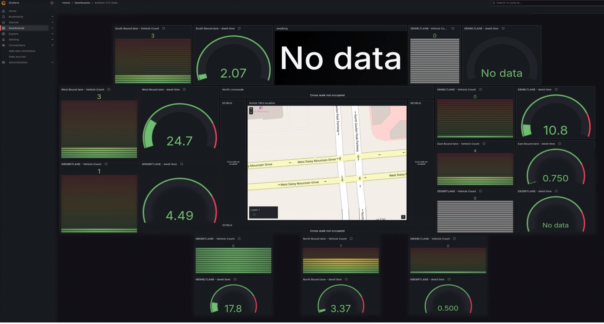

# How to Use the Application

Once deployed (via Docker Compose or Helm) this guide will help you:
- Verify that the application is running correctly.
- Access the application's features and user interfaces.
- Understand how to interact with the various components of the Smart Intersection Sample Application.

By following this guide, you will be able to explore the application's capabilities, such as real-time traffic monitoring, data visualization, and system management.

## **Access the Application and Components** ##

### **Application UI** ###

Open a browser and go to the following endpoints to access the application. Use `<actual_ip>` instead of `localhost` for external access:

> **Notes**
> - Ensure that port forwarding is set up for each service before accessing the URLs.
> - For passwords stored in files (e.g., `supass` or `influxdb2-admin-token`), refer to the respective secret files in your deployment under ./src/secrets (Docker) or chart/files/secrets (Helm).

- **URL**: [https://localhost](https://localhost)
- **Log in with credentials**:
    - **Username**: `admin`
    - **Password**: Stored in `supass`. (Check `./src/secrets/supass`)

> **Notes**:
> - After starting the application, wait approximately 1 minute for the MQTT broker to initialize. You can confirm it is ready when green arrows appear for MQTT in the application interface. Since the application uses HTTPS, your browser may display a self-signed certificate warning. For the best experience, it is recommended to use **Google Chrome**.

### **Grafana UI** ###
- **URL**: [http://localhost:3000](http://localhost:3000)
- **Log in with credentials**:
    - **Username**: `admin`
    - **Password**: `admin` (You will be prompted to change it on first login.)

### **InfluxDB UI** ###
- **URL**: [http://localhost:8086](http://localhost:8086)
- **Log in with credentials**:
    - **Username**: `<your_influx_username>` (Check `./src/secrets/influxdb2/influxdb2-admin-username`)
    - **Password**: `<your_influx_password>` (Check `./src/secrets/influxdb2/influxdb2-admin-password`).

### **NodeRED UI** ###
- **URL**: [http://localhost:1880](http://localhost:1880)

### **DL Streamer Pipeline Server** ###
- **REST API**: [http://localhost:8080](http://localhost:8080)
- **WebRTC**: [http://localhost:8555](http://localhost:8555)

## Verify the Application

- **Fused object tracks**: In Scene Management UI, click on the Intersection-Demo card to navigate to the Scene. On the Scene page, you will see fused tracks moving on the map. You will also see greyed out frames from each camera. Toggle the "Live View" button to see the incoming camera frames. The object detections in the camera feeds will correlate to the tracks on the map.
      
- **Grafana Dashboard**: In Grafana UI, observe aggregated analytics of different regions of interests in the grafana dashboard. After navigating to Grafana home page, click on "Dashboards" and click on item "Anthem-ITS-Data".
      

## Resources

- **[Troubleshooting Guide](./support.md)**: Find detailed steps to resolve common issues during deployments.
- **[Get Started](./get-started.md)**: Ensure you have completed the initial setup steps.
- **[Deploy Using Docker Compose](./how-to-deploy-docker.md)**: Ensure you have used Docker Compose to quickly set up and run the application in a containerized environment.
- **[Deploy Using Helm](./how-to-deploy-helm.md)**: Ensure you have used Helm to deploy the application to a Kubernetes cluster for scalable and production-ready deployments.
