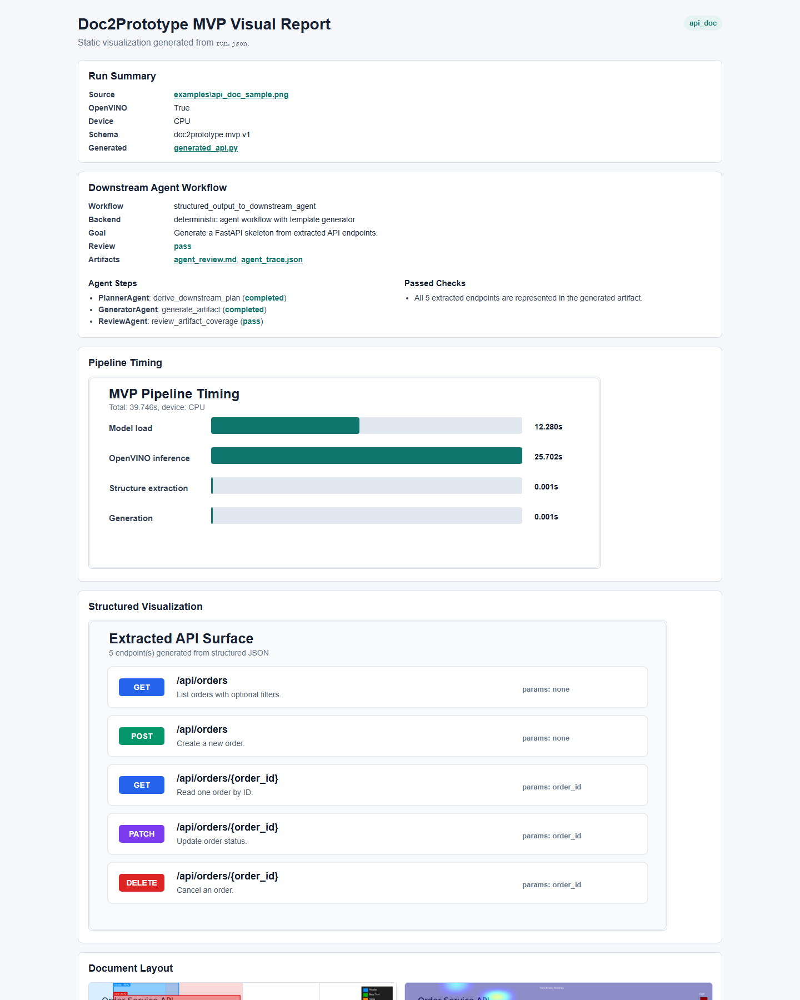
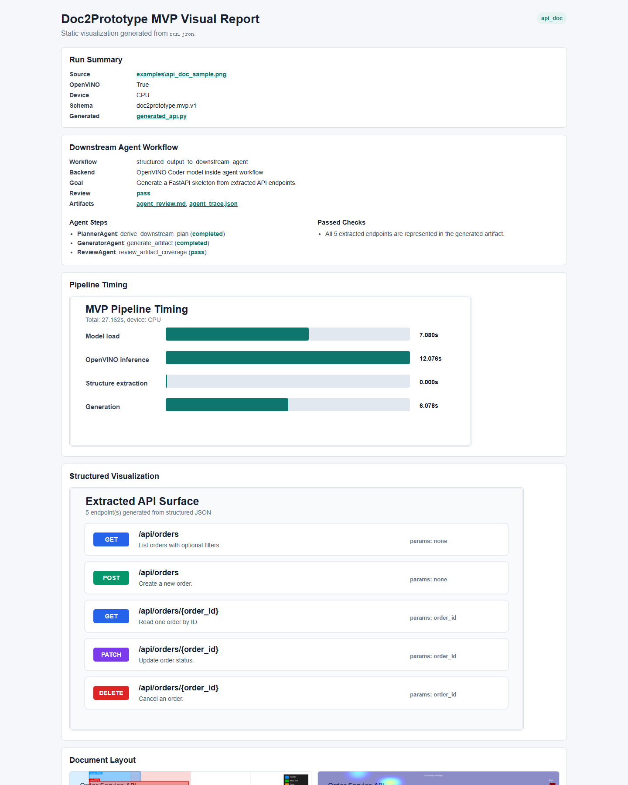
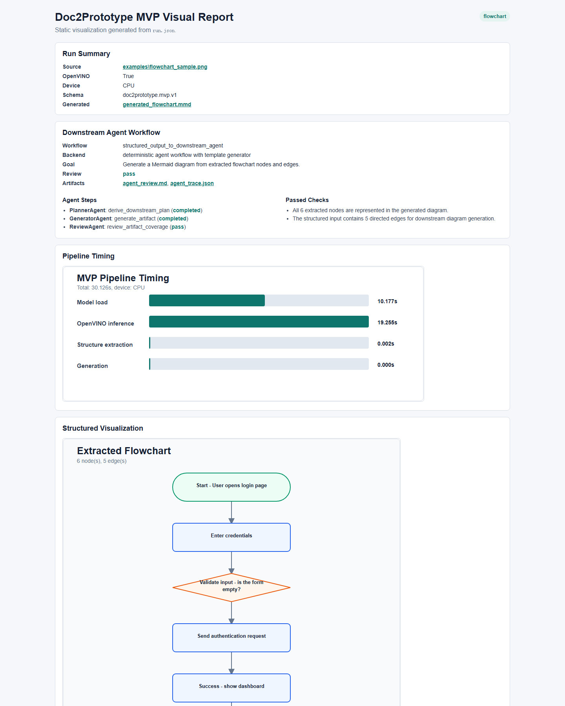

# Doc2Prototype with OpenVINO

Doc2Prototype is a command-line MVP demo for turning technical documents into structured JSON and downstream prototype artifacts.

The current scope is intentionally narrow:

- API documentation image -> PaddleOCR-VL with OpenVINO -> structured endpoint JSON -> FastAPI skeleton
- Flowchart image -> PaddleOCR-VL with OpenVINO -> structured nodes/edges JSON -> Mermaid flowchart

An optional official/reference sample path is included for sanity-checking general PaddleOCR-VL document recognition with a Markdown technical summary.

The demo also writes a static visual report with timing charts, extracted structure diagrams, document layout overlays, and text-density heatmaps.

## Requirements

- Python 3.10-3.12
- OpenVINO-compatible CPU. GPU/NPU/AUTO can be selected with `--device` when available. Use exact device IDs such as `GPU.0` or `GPU.1` when multiple GPU plugins are visible.
- Enough disk space for PaddleOCR-VL and converted OpenVINO IR files. Model files are not committed to this repository.
- `openvino-genai` is used by the recommended local OpenVINO Coder backend.

## Setup

```bash
cd openvino_build_deploy/demos/doc2prototype_demo
python3 -m venv venv
source venv/bin/activate
python -m pip install --upgrade pip
pip install -r requirements.txt
```

## Prepare the OpenVINO Model

Run this once to download PaddleOCR-VL and export it to OpenVINO IR:

```bash
python prepare_model.py --device CPU
```

The converted model is written to `ov_paddleocr_vl_model/`. This directory is intentionally ignored by git.

## Run the MVP Demo

Generate clean sample PNG inputs:

```bash
python scripts/make_sample_images.py
```

Run the API documentation scenario:

```bash
python main.py examples/api_doc_sample.png --task api_doc --device CPU --output-dir outputs/mvp_api_image_smoke
```

For API document images, the default parser prompt is `OCR:`. The endpoint schema is then extracted deterministically from the OCR text, which is more stable than asking the vision-language model to directly infer the API schema.

On Intel Core Ultra systems, `GPU`, `NPU`, and `AUTO` may be visible through OpenVINO but can be less stable for this stateful PaddleOCR-VL LLM path than CPU. Image runs therefore use a hardware-aware fallback by default:

- The requested `--device` is tried first.
- If that device fails, or if it produces no task structure such as API endpoints or flowchart nodes, the CLI retries with `--fallback-device CPU`.
- `run.json`, `result.md`, `metrics.svg`, and `visual_report.html` record both the requested and effective devices.
- Use `--no-device-fallback` to benchmark only the requested device and preserve failures.

Example Intel iGPU probe with quality fallback:

```bash
python main.py examples/api_doc_sample.png --task api_doc --device GPU.0 --fallback-device CPU --output-dir outputs/mvp_api_gpu0_probe
```

Run the flowchart scenario:

```bash
python main.py examples/flowchart_sample.png --task flowchart --device CPU --output-dir outputs/mvp_flow_image_smoke
```

Fast structure-only smoke tests can use the Markdown samples and do not require the OpenVINO model:

```bash
python main.py examples/api_doc_sample.md --task api_doc --output-dir outputs/mvp_api_text_smoke
python main.py examples/flowchart_sample.md --task flowchart --output-dir outputs/mvp_flow_text_smoke
```

## Run an Official Reference Sample

The MVP scenarios above use project-specific API and flowchart inputs. To also show that the OpenVINO PaddleOCR-VL path works on an official/reference document image, prepare the sample image:

```bash
python scripts/prepare_official_sample.py
```

The script first tries to copy the OpenVINO Notebooks PaddleOCR-VL sample from `openvino_notebooks/notebooks/paddleocr_vl/test.png`. If that checkout is not available, it downloads the public PaddleOCR-VL demo image.

Run the reference sample as a generic technical document:

```bash
python main.py examples/official_paddleocr_vl_sample.png --task technical_doc --prompt "OCR:" --device CPU --output-dir outputs/mvp_official_reference
```

This produces structured section JSON, a Markdown technical summary, OpenVINO timing data, and the same visual report format used by the MVP scenarios.

## Outputs

Each run writes:

- `raw_parse.md`: PaddleOCR-VL parser output
- `structured.json`: structured schema output
- `generated_api.py` or `generated_flowchart.mmd`: downstream prototype artifact
- `agent_trace.json`: structured downstream agent workflow trace
- `agent_review.md`: downstream coverage review result
- `metrics.svg`: pipeline timing chart
- `api_endpoints.svg` or `flowchart.svg`: extracted structure visualization
- `document_summary.svg`: extracted section visualization for the optional technical document reference sample
- `layout_overlay.png`: document layout overlay with OpenVINO watermark
- `text_heatmap.png`: text density heatmap with OpenVINO watermark
- `visual_report.html`: single-page report linking all artifacts
- `run.json`: machine-readable run metadata and timing

Example reports are included under:

- `outputs/mvp_api_image_smoke/visual_report.html`
- `outputs/mvp_flow_image_smoke/visual_report.html`

## Low-Quality Input Behavior

Blurry, low-resolution, or text-sparse images should not crash the demo. The pipeline still writes the normal output files so users can inspect what happened:

- `raw_parse.md` contains whatever text PaddleOCR-VL could read.
- `structured.json` may contain empty `endpoints`, `nodes`, or `sections` when there is not enough readable text.
- `agent_review.md` reports `needs_attention` instead of `pass` when coverage cannot be verified.
- The CLI prints `[mvp] warning:` lines when very little text or no task structure is extracted.
- `visual_report.html` shows a Warnings section, plus timing, the structured preview, and any available layout overlay or text heatmap.

Use `agent_review.md` as the main quality signal for weak OCR runs. For example, an API document with no extracted endpoints or a flowchart with no extracted nodes is considered a run that needs manual review, not a successful extraction.

## Effect Display

The tracked smoke reports demonstrate the complete path from document/visual understanding to downstream agent processing.

API document image to deterministic FastAPI skeleton:



This report uses `examples/api_doc_sample.png` as input. PaddleOCR-VL runs through OpenVINO, extracts the order-service API text, and the deterministic structure extractor creates a JSON schema with five endpoints. The downstream Agent workflow then checks that the generated FastAPI skeleton covers all five endpoints. The timing chart separates model load, OpenVINO inference, structure extraction, and generation time. The layout overlay marks detected text regions, and the heatmap shows where text density is concentrated in the input image.

API document image to OpenVINO Coder model:



This report uses the same API document image but switches the downstream generator to `OpenVINO/Qwen2.5-Coder-0.5B-Instruct-int4-ov` through the `openvino` backend. It shows the full OpenVINO path: PaddleOCR-VL OpenVINO parsing first, then OpenVINO GenAI Coder generation inside the Agent workflow. A successful result should show `OpenVINO: True`, `Backend: OpenVINO Coder model inside agent workflow`, five extracted endpoints, and Agent review status `pass`.

Flowchart image to Mermaid diagram:



This report uses `examples/flowchart_sample.png` as input. PaddleOCR-VL runs through OpenVINO, the structure extractor creates a JSON schema with six nodes and five directed edges, and the downstream Agent generates a Mermaid diagram. A successful result should show all extracted nodes in the structured visualization and Agent review status `pass`.

## Reviewer Quick Reproduction

From this demo directory, the following commands reproduce the two primary smoke reports used for PR review:

```bash
python prepare_model.py --device CPU
python scripts/make_sample_images.py
python main.py examples/api_doc_sample.png --task api_doc --device CPU --output-dir outputs/mvp_api_image_smoke
python main.py examples/flowchart_sample.png --task flowchart --device CPU --output-dir outputs/mvp_flow_image_smoke
```

The expected high-level results are:

| Scenario | OpenVINO | Device | Structured output | Downstream artifact | Agent review |
| --- | --- | --- | --- | --- | --- |
| API document image | yes | CPU | 5 endpoints | `generated_api.py` | pass |
| Flowchart image | yes | CPU | 6 nodes / 5 edges | `generated_flowchart.mmd` | pass |

## Recommended OpenVINO Coder Backend

The default generator remains deterministic so the MVP is quick to reproduce without downloading a second model. For the real local Coder model path, the recommended backend is OpenVINO GenAI with a pre-converted OpenVINO Coder model. HuggingFace Transformers remains available only as a fallback or comparison backend.

Download the OpenVINO Coder model:

```bash
python -c "from code_generator import download_openvino_code_model; print(download_openvino_code_model())"
```

This downloads [`OpenVINO/Qwen2.5-Coder-0.5B-Instruct-int4-ov`](https://huggingface.co/OpenVINO/Qwen2.5-Coder-0.5B-Instruct-int4-ov), a pre-converted INT4 OpenVINO IR model, to `_models/OpenVINO/Qwen2.5-Coder-0.5B-Instruct-int4-ov`.

Run the full image-to-OpenVINO-Coder path:

```bash
python main.py examples/api_doc_sample.png --task api_doc --device CPU --code-model-path _models/OpenVINO/Qwen2.5-Coder-0.5B-Instruct-int4-ov --code-model-backend openvino --code-max-new-tokens 768 --output-dir outputs/mvp_api_image_ov_coder
```

Validated local result:

| Scenario | Parser backend | Coder backend | Device | Structured output | Agent review | Total |
| --- | --- | --- | --- | --- | --- | ---: |
| API image + OpenVINO Coder | PaddleOCR-VL OpenVINO | OpenVINO GenAI Coder | CPU | 5 endpoints | pass | 27.162 s |

## View Reports and Capture Screenshots

After running the demo, open `visual_report.html` in a browser to inspect the full result.

If the project is running in WSL on Windows, the example reports can be opened from File Explorer or a browser with:

```text
\\wsl.localhost\Ubuntu\root\Doc2Prototype\openvino_build_deploy\demos\doc2prototype_demo\outputs\mvp_api_image_smoke\visual_report.html
```

```text
\\wsl.localhost\Ubuntu\root\Doc2Prototype\openvino_build_deploy\demos\doc2prototype_demo\outputs\mvp_flow_image_smoke\visual_report.html
```

Recommended screenshots for reporting:

- API document report: run summary, pipeline timing, extracted API surface, layout overlay, and text heatmap.
- Flowchart report: run summary, pipeline timing, extracted flowchart, layout overlay, and text heatmap.
- Pull request page: PR number, open status, and successful checks.

On Windows, press `Win + Shift + S`, select the browser region, and save the screenshots for the weekly report.

## OpenVINO Value Shown

- PaddleOCR-VL inference runs through an OpenVINO IR model.
- The recommended local Coder path uses a pre-converted OpenVINO GenAI model with `--code-model-backend openvino`.
- The CLI exposes device selection with `--device CPU|GPU|GPU.0|GPU.1|NPU|AUTO`.
- Each run records model load time, OpenVINO inference time, structure extraction time, generation time, and total time.
- Visual outputs include OpenVINO watermarking.

## Hardware Validation Scope

The validation focus is Intel hardware and OpenVINO deployment. The local development machine used for this round exposes Intel CPU, Intel iGPU, Intel NPU, and an NVIDIA dGPU through OpenVINO device discovery. Results and recommendations should be interpreted as follows:

- `CPU`: primary reproducible path for this PR.
- `GPU.0`: Intel iGPU path; useful for optional Intel GPU validation, with CPU fallback enabled when OCR quality is insufficient.
- `NPU` and `AUTO`: visible but currently limited by the stateful/dynamic-shape LLM path in the PaddleOCR-VL export, so the CLI records failures and falls back to CPU unless `--no-device-fallback` is set.
- `GPU.1`: NVIDIA dGPU on this local machine; it is not used as a project highlight or primary benchmark for the Intel/OpenVINO task.

If final validation needs to match the provided GMK Intel Core Ultra mini PC more closely, run the same branch and commands on that device and report CPU / Intel iGPU / NPU behavior there.

## Notes

The downstream code generation path is deterministic by default so the MVP remains reproducible without downloading a second LLM. For real local Coder inference, prefer the OpenVINO backend shown above. The HuggingFace backend can still be selected with `--code-model-backend hf` for fallback or comparison runs.

## Downstream Agent Flow

After PaddleOCR-VL parsing and structured JSON extraction, the CLI routes the result through a downstream agent workflow:

1. `PlannerAgent` summarizes the structured input and selects the downstream artifact target.
2. `GeneratorAgent` invokes the code/summary generator. By default this uses deterministic templates for reproducibility; when `--code-model-path` is provided, the recommended path is a local OpenVINO GenAI Coder model with `--code-model-backend openvino`. Select `hf` only as a fallback or comparison backend.
3. `ReviewAgent` checks whether the generated artifact covers the extracted endpoints, flowchart nodes, or document sections.

Each run writes:

- `agent_trace.json`: machine-readable agent plan, steps, backend, and review status.
- `agent_review.md`: human-readable review of the downstream generation result.

This makes the required handoff from document understanding to downstream intelligent processing explicit and reproducible without forcing users to download a second LLM for the default MVP path.

Fallback local HuggingFace Coder run:

```bash
python -c "from code_generator import download_code_model; print(download_code_model('Qwen/Qwen2.5-Coder-0.5B-Instruct'))"
python main.py examples/api_doc_sample.md --task api_doc --code-model-path <printed-model-path> --code-model-backend hf --code-max-new-tokens 768 --output-dir outputs/mvp_api_text_hf_coder
```

For example, ModelScope may print a local path similar to `_models\Qwen\Qwen2___5-Coder-0___5B-Instruct` on Windows.

To validate the full image-to-HuggingFace-Coder fallback path:

```bash
python main.py examples/api_doc_sample.png --task api_doc --device CPU --code-model-path <printed-model-path> --code-model-backend hf --code-max-new-tokens 768 --output-dir outputs/mvp_api_image_hf_coder
```
