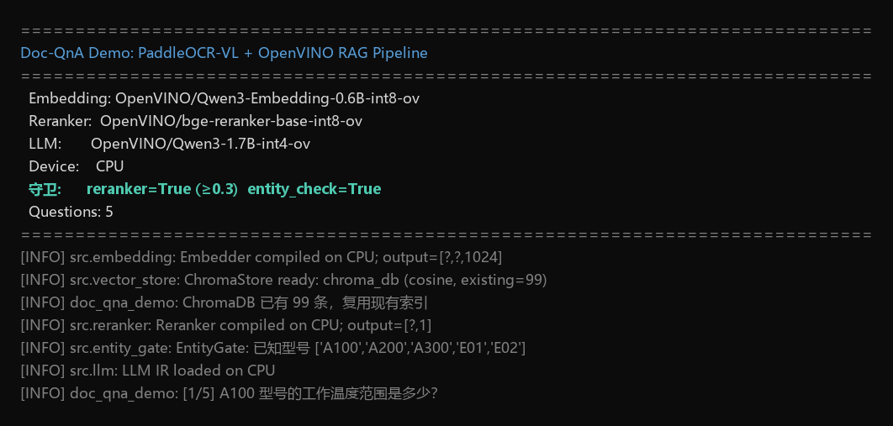
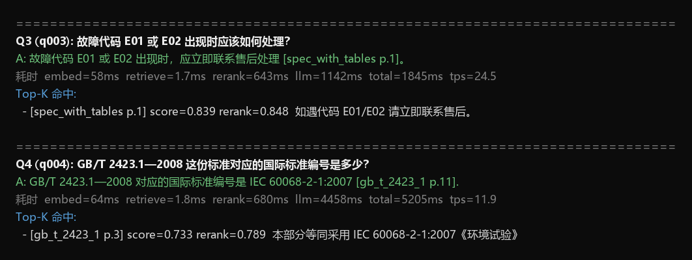
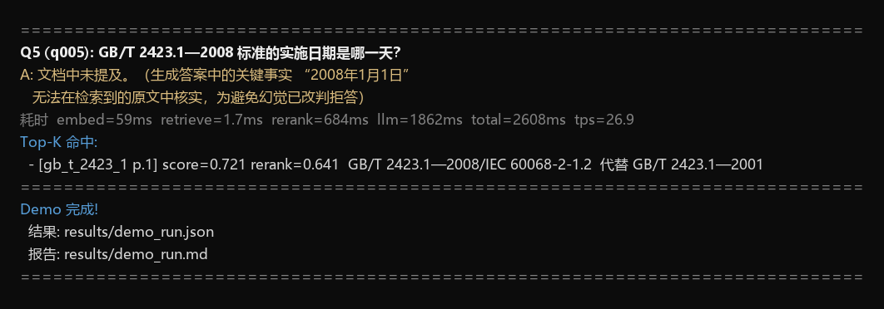
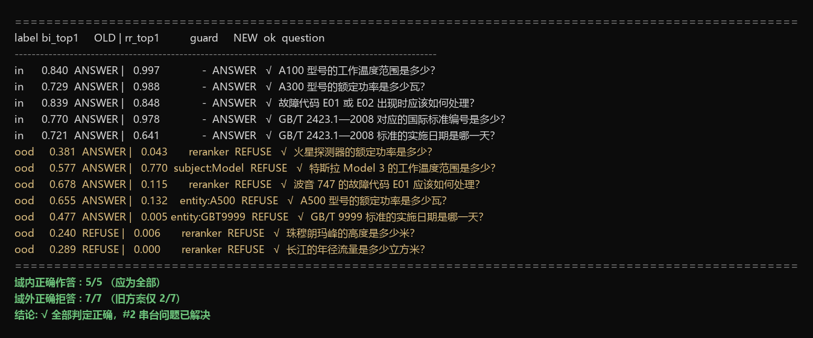

# Document Q&A with PaddleOCR-VL and OpenVINO™

Intelligent document understanding and question answering system powered by PaddleOCR-VL and OpenVINO. Upload product manuals (PDF/scanned documents/spec sheets with tables), and the system automatically parses, indexes, and answers questions with source citations.

**Full pipeline**: PDF → PaddleOCR-VL OCR (OpenVINO) → Table-aware Chunking → Qwen3-Embedding (OpenVINO) → ChromaDB → bge-reranker (OpenVINO) → Qwen3-1.7B LLM (OpenVINO GenAI) → Answers with `[doc_name p.page]` citations, protected by a 4-stage anti-hallucination guard.

All inference runs on **OpenVINO** — no PyTorch or external API needed.








## Demo Output

```
Q1: A100 型号的工作温度范围是多少？
A:  A100 型号的工作温度范围是 -20~70℃ [spec_with_tables p.1]
⏱  embed=147ms  retrieve=1.8ms  rerank=683ms  llm=3217ms  total=3944ms

Q2: A300 型号的额定功率是多少瓦？
A:  A300 型号的额定功率是 500W [spec_with_tables p.1]

Q4: GB/T 2423.1—2008 对应的国际标准编号是多少？
A:  IEC 60068-2-1:2007 [gb_t_2423_1 p.11]

Q5: GB/T 2423.1—2008 标准的实施日期是哪一天？
A:  文档中未提及。（生成答案中的关键事实 "2008年1月1日" 无法在检索到的
    原文中核实，为避免幻觉已改判拒答）   ← answer-grounding guard in action
```

| Metric | Value (CPU, Intel i5) |
|--------|----------------------|
| Embed query | 69 ms |
| Retrieve | 1.8 ms |
| Rerank (cross-encoder, top-20) | 660 ms |
| LLM generate | 2,381 ms |
| **End-to-end per question** | **3,112 ms** |
| LLM throughput | 18.9 tok/s |

## Quick Launch

### Windows

[Download install.bat](setup/install.bat), then double-click it. The script will clone the repo, create a virtual environment, install dependencies, and run the demo automatically.

### Linux / macOS

```bash
wget https://raw.githubusercontent.com/openvinotoolkit/openvino_build_deploy/master/demos/doc_qna_demo/setup/install.sh
chmod +x install.sh && ./install.sh
```

## Manual Setup (One Command)

Supported Python versions: 3.10, 3.11, 3.12

```bash
cd demos/doc_qna_demo
python main.py
```

That's it. `main.py` **auto-installs** missing dependencies and **auto-downloads** models on first run. No separate `pip install` step needed.

Windows users: if you see encoding errors, run `set PYTHONIOENCODING=utf-8` first.

### Customize

```bash
# Single question
python main.py --question "A100 工作温度是多少？"

# Switch device (CPU / GPU / AUTO)
python main.py --device GPU

# Use a different LLM
python main.py --llm_model_id OpenVINO/Qwen3-8B-int4-ov
```

## Architecture

```
┌─────────────────────────────────────────────────────────────┐
│  PDF / Scanned Documents / Spec Sheets                      │
└──────────────────────┬──────────────────────────────────────┘
                       ▼
┌──────────────────────────────────────────────────────────────┐
│  PaddleOCR-VL (OpenVINO)                                     │
│  Vision-language OCR → Structured Markdown                   │
└──────────────────────┬───────────────────────────────────────┘
                       ▼
┌──────────────────────────────────────────────────────────────┐
│  Table-aware Chunking                                        │
│  Table rows with headers + semantic paragraph splitting      │
└──────────────────────┬───────────────────────────────────────┘
                       ▼
┌──────────────────────────────────────────────────────────────┐
│  Qwen3-Embedding-0.6B-int8 (OpenVINO)                       │
│  1024-dim multilingual embeddings → ChromaDB                 │
└──────────────────────┬───────────────────────────────────────┘
                       ▼
┌──────────────────────────────────────────────────────────────┐
│  Qwen3-1.7B-int4 (OpenVINO GenAI)                           │
│  RAG generation with source citations [doc p.page]           │
└──────────────────────────────────────────────────────────────┘
```

## Models

All models use pre-converted OpenVINO IR from HuggingFace (auto-downloaded on first run):

| Role | Model | Size | Device |
|------|-------|------|--------|
| OCR | [PaddleOCR-VL-1.5-ov](https://huggingface.co/zhaohb/PaddleOCR-VL-1.5-ov) | ~2.7 GB | CPU/GPU |
| Embedding | [Qwen3-Embedding-0.6B-int8-ov](https://huggingface.co/OpenVINO/Qwen3-Embedding-0.6B-int8-ov) | ~600 MB | CPU/GPU |
| Reranker | [bge-reranker-base-int8-ov](https://huggingface.co/OpenVINO/bge-reranker-base-int8-ov) | ~300 MB | CPU/GPU |
| LLM | [Qwen3-1.7B-int4-ov](https://huggingface.co/OpenVINO/Qwen3-1.7B-int4-ov) | ~1 GB | CPU/GPU |

**Disk requirement**: ~8 GB total (models + venv + ChromaDB).

## Key Features

- **Table-aware chunking**: Each table row carries its header as context, enabling precise cell-level lookup (e.g., "A300 rated power → 500W")
- **4-stage anti-hallucination guard** (see below): entity-consistency gate → cross-encoder reranking → subject grounding → answer fact grounding, on top of a strictly grounded system prompt. Measured on the bundled corpus: **5/5 in-domain questions answered, 7/7 out-of-domain / entity-confusion questions correctly refused** (reproduce with `python scripts/eval_guard.py`)
- **Source citations**: Every answer includes `[doc_name p.page]` traceable to the original document
- **All-OpenVINO inference**: OCR, Embedding, Reranker, and LLM all run through OpenVINO — no PyTorch dependency at inference time
- **CPU-friendly**: Full pipeline runs at ~3.1s/question on Intel i5 (CPU-only)

## Anti-Hallucination Guard

A single retrieval-similarity floor cannot reliably separate in-domain from out-of-domain questions: on the bundled corpus, in-domain top-1 cosine scores fall in [0.722, 0.840] while out-of-domain scores reach up to 0.465 — a question mixing an out-of-domain entity with an in-domain field (e.g., *"the Mars rover's rated power"*) retrieves the "rated power" chunk with elevated similarity and slips past any safe threshold. The demo therefore chains four complementary guards:

1. **Entity-consistency gate** (`src/entity_gate.py`, deterministic, pre-embedding): a question naming an in-domain-shaped entity that does not exist in the corpus (model `A500`, unknown standard number `GB/T 9999`) is refused immediately.
2. **Cross-encoder reranking** (`src/reranker.py`, the workhorse): bi-encoder recalls top-20 candidates, then [bge-reranker-base-int8-ov](https://huggingface.co/OpenVINO/bge-reranker-base-int8-ov) jointly encodes (query, chunk) and *sees* the subject mismatch — the Mars-rover question scores sigmoid **0.043** vs 0.98+ for in-domain questions. If all reranked hits fall below `--rerank_min_score` (default 0.30), the question is refused before reaching the LLM.
3. **Subject grounding**: under a very strong field match the reranker can still score high (*"Tesla Model 3's operating temperature"* → 0.77); this guard checks that the query's subject terms actually appear in the evidence and refuses when none of them ground.
4. **Answer fact grounding** (`src/answer_grounding.py`, post-generation): every date/number in the generated answer must be verifiable in the retrieved evidence, otherwise the answer is replaced with a refusal — this catches silent hallucinations on retrieval misses (e.g., the model fabricating an implementation date from the standard's year).

Stages 1–3 run retrieval-side before the LLM; stage 4 verifies the generated answer. Evaluation (`python scripts/eval_guard.py`, 5 in-domain + 7 out-of-domain/entity-confusion questions from `data/eval_out_of_domain.txt`): **in-domain 5/5 answered, out-of-domain 7/7 refused** — the previous single-threshold approach caught only 2/7. Each guard can be disabled individually (`--no_reranker`, `--no_entity_check`, `--no_subject_check`, `--no_answer_check`) for A/B comparison.

## CLI Arguments

| Argument | Default | Description |
|----------|---------|-------------|
| `--question` | — | Single question (overrides `--questions_file`) |
| `--questions_file` | `data/demo_questions.txt` | One question per line |
| `--device` | `CPU` | OpenVINO device: CPU / GPU / AUTO |
| `--embed_model_id` | `OpenVINO/Qwen3-Embedding-0.6B-int8-ov` | Embedding model |
| `--llm_model_id` | `OpenVINO/Qwen3-1.7B-int4-ov` | LLM model |
| `--reranker_model_id` | `OpenVINO/bge-reranker-base-int8-ov` | Cross-encoder reranker (main anti-confusion guard) |
| `--top_k` | `5` | Number of chunks that enter the LLM context |
| `--retrieve_top_k` | `20` | Bi-encoder recall size before reranking narrows to `top_k` |
| `--min_score` | `0.0` with reranker / `0.35` without | Bi-encoder similarity pre-filter (the reranker handles refusal when enabled) |
| `--rerank_min_score` | `0.30` | Refuse when all reranked hits fall below this relevance |
| `--no_reranker` | off | Disable cross-encoder reranking (falls back to bi-encoder + `min_score 0.35`) |
| `--no_entity_check` | off | Disable the entity-consistency gate |
| `--no_subject_check` | off | Disable the subject-grounding guard |
| `--no_answer_check` | off | Disable the answer fact-grounding guard |
| `--max_new_tokens` | `384` | Max generation length |
| `--out` | `results/demo_run.json` (`results/demo_run_single.json` in `--question` mode) | JSON output path |
| `--out_md` | `results/demo_run.md` (`results/demo_run_single.md` in `--question` mode) | Markdown report path |

## Known Limitations

1. **Conservative refusal on short answers — mitigated**: The 1.7B LLM may refuse to answer when the retrieved evidence is a brief referral (e.g., "contact after-sales service") rather than a detailed procedure. With reranking the evidence set is cleaner and this case now answers correctly on the bundled corpus, but trickier "short-hint vs. strict-grounding" edges may still refuse conservatively. Larger models (7B+) handle this better.
2. **Retrieval miss on semantically diluted chunks**: When the target fact is buried in a chunk dominated by other content (e.g., English headers), the small embedding model may miss recall entirely, so even the reranker never sees the right chunk. The answer fact-grounding guard safely converts the resulting hallucination into a refusal (see Q5 in the demo output), but *answering correctly* would require better recall (finer chunking, parent-child retrieval, or a stronger embedding model).
3. **Entity confusion on semantically-adjacent out-of-domain questions — resolved**: Previously, a question mixing an out-of-domain entity with an in-domain field (e.g., "the Mars rover's rated power") could slip past the single `--min_score` threshold, because in-domain and out-of-domain cosine ranges overlap (in-domain top-1 ∈ [0.722, 0.840], out-of-domain up to 0.465). This is now handled by the 4-stage guard described above: measured in-domain 5/5 answered, out-of-domain 7/7 refused (vs. 2/7 with the old threshold-only approach). Reproduce with `python scripts/eval_guard.py`.

## License

This demo is provided "as is" for demonstration and educational purposes.
